# Yote Wayfinder Architecture Diagram

This is the maintained visual map of the project. Solid arrows and green or
gold boxes represent implemented behavior. Dashed arrows are labeled to distinguish
contract implementations, verification relationships, and planned integrations;
gray boxes show components that have not been built.
Update this diagram whenever a major module, data flow, external dependency, or
architectural boundary changes.

```mermaid
flowchart TB
    User([Person using Yote Wayfinder])

    subgraph Browser[Browser application]
        Index[index.html<br/>HTML host]
        Main[src/main.tsx<br/>React entry]
        App[src/app/App.tsx<br/>screen composition and map mode]

        subgraph NavigationUI[Navigation feature]
            Panel[NavigationPanel.tsx<br/>inputs, suggestions, route summary]
            PlannerHook[useRoutePlanner.ts<br/>shared planner state]
            PlannerModel[routePlanner.ts<br/>search and route outcomes]
            LocationContract[LocationProvider.ts<br/>one-shot provider contract]
            NavigationControls[CheckpointNavigation.tsx<br/>Start navigation, Next Turn, recovery]
            CheckpointHook[useCheckpointNavigation.ts<br/>request guard and session state]
            BrowserProvider[BrowserLocationProvider.ts<br/>validated readings and typed failures]
            PrototypeProvider[PrototypeLocationProvider.ts<br/>expected-checkpoint simulation]
        end

        subgraph NavigationDomain[Provider-independent navigation domain]
            WalkingRoutes[walkingRoutes.ts<br/>path-to-route conversion]
            Pathfinder[pathfinding.ts<br/>Dijkstra shortest path]
            RouteSteps[routeSteps.ts<br/>maneuvers, instructions, checkpoints]
            LocationVerification[locationVerification.ts<br/>distance and accuracy classification]
            NavigationSession[navigationSession.ts<br/>explicit progress state machine]
            DomainTypes[types.ts<br/>locations, routes, graph contracts]
            Factories[factories.ts<br/>validation and immutability]
        end

        subgraph MapFeature[Map feature]
            MapView[MapView.tsx<br/>React lifecycle and controls]
            MapContract[MapAdapter.ts<br/>provider-neutral contract]
            BuildingContract[GeoreferencedBuilding.ts<br/>owned building description]
            Adapter[MapLibreMapAdapter.ts<br/>map lifecycle and overlays]
            BuildingLayer[MapLibreGeoreferencedBuildingLayer.ts<br/>shared WebGL 3D layer]
        end

        subgraph Rendering[Rendering libraries]
            MapLibre[MapLibre GL JS<br/>projection, camera, basemap, overlays]
            Three[Three.js<br/>3D geometry, lights, materials]
            GPU[(WebGL / device GPU)]
        end
    end

    subgraph Composition[Application composition boundary]
        CreateAdapter[createMapAdapter.ts<br/>constructs concrete integrations]
        CreateLocation[createLocationProvider.ts<br/>selects prototype or browser provider]
    end

    subgraph OwnedData[Project-owned data]
        GraphData[collegeOfIdahoWalkingGraphData.ts<br/>editable graph and provenance]
        GraphLoader[collegeOfIdahoWalkingGraph.ts<br/>validated runtime release]
        Locations[mockLocations.ts<br/>searchable locations derived from graph]
        Campus[collegeOfIdahoCampus.ts<br/>center, bounds, initial zoom]
        Scene[collegeOfIdahoScene.ts<br/>illustrative 3D calibration building]
    end

    subgraph ExternalRuntime[Current external runtime dependency]
        OSM[OpenStreetMap raster tiles<br/>prototype basemap]
        BrowserGPS[Browser Geolocation API<br/>one-shot location requests]
    end

    subgraph QualityAndKnowledge[Development quality and project knowledge]
        Tests[Vitest and Testing Library<br/>focused automated tests]
        Tooling[TypeScript, ESLint, Prettier, Vite<br/>strict checks and bundling]
        Handbook[README and docs<br/>architecture, progress, skills, decisions]
        Context7[Context7 MCP<br/>current library documentation]
        AgentRules[AGENTS.md<br/>approval and engineering rules]
    end

    subgraph ApprovedFuture[Approved future integrations - not implemented]
        ModelPipeline[Authorized photos and photogrammetry<br/>optimized GLB and KTX2 assets]
    end

    User --> Index --> Main --> App
    App --> Panel
    App --> MapView
    NavigationControls --> App
    App -->|navigation session| MapView
    Panel --> PlannerHook --> PlannerModel --> WalkingRoutes
    PlannerHook --> GraphLoader
    PlannerHook --> Locations
    WalkingRoutes --> Pathfinder
    WalkingRoutes --> RouteSteps
    WalkingRoutes --> Factories
    RouteSteps --> DomainTypes
    NavigationSession --> RouteSteps
    NavigationSession --> LocationVerification
    LocationVerification --> DomainTypes
    LocationContract --> DomainTypes
    Pathfinder --> DomainTypes
    Factories --> DomainTypes
    GraphLoader --> GraphData
    GraphLoader --> Factories
    Locations --> GraphData
    Locations --> Factories
    WalkingRoutes --> MapView

    MapView --> MapContract --> CreateAdapter --> Adapter
    Adapter -->|leg colors and turn camera| MapLibre
    Campus --> MapView
    Scene --> CreateAdapter
    BuildingContract --> BuildingLayer
    CreateAdapter --> BuildingLayer
    Adapter --> MapLibre
    Adapter --> BuildingLayer
    BuildingLayer --> Three
    MapLibre --> GPU
    Three --> GPU
    OSM --> MapLibre

    Tests -. verify .-> NavigationDomain
    Tests -. verify .-> MapFeature
    Tooling -. checks and bundles .-> Browser
    Handbook -. explains .-> Browser
    AgentRules -. governs changes .-> QualityAndKnowledge
    Context7 -. current dependency docs .-> QualityAndKnowledge

    App --> CreateLocation
    CreateLocation --> PrototypeProvider
    CreateLocation --> BrowserProvider
    Panel --> NavigationControls --> CheckpointHook
    CheckpointHook --> LocationContract
    BrowserProvider -. implements .-> LocationContract
    PrototypeProvider -. implements .-> LocationContract
    BrowserProvider --> BrowserGPS
    CheckpointHook --> NavigationSession
    NavigationSession --> NavigationControls
    ModelPipeline -. planned replacement assets .-> Scene

    classDef implemented fill:#dff3e7,stroke:#155f3a,color:#082f20,stroke-width:2px
    classDef integration fill:#fff0c2,stroke:#9b6500,color:#493000,stroke-width:2px
    classDef external fill:#e9f0ff,stroke:#315da8,color:#172f58,stroke-width:2px
    classDef future fill:#eeeeee,stroke:#777,color:#333,stroke-dasharray:6 4

    class Index,Main,App,Panel,PlannerHook,PlannerModel,LocationContract,WalkingRoutes,Pathfinder,RouteSteps,LocationVerification,NavigationSession,DomainTypes,Factories,MapView,MapContract,BuildingContract,GraphData,GraphLoader,Locations,Campus,Scene implemented
    class CreateAdapter,Adapter,BuildingLayer,MapLibre,Three,GPU integration
    class OSM,Tests,Tooling,Handbook,Context7,AgentRules external
    class NavigationControls,CheckpointHook implemented
    class CreateLocation,BrowserProvider,PrototypeProvider integration
    class BrowserGPS external
    class ModelPipeline future
```

## How to read the diagram

- The navigation domain has no dependency on MapLibre or Three.js. It can be
  tested and changed without starting a map.
- `MapAdapter` is the boundary used by React. `createMapAdapter.ts` selects
  MapLibre and the Three.js building layer at the application edge.
- The walking graph is the routing authority. The 3D scene is visual content and
  cannot define an entrance or a safe walking path by itself.
- `routeSteps.ts` is implemented domain logic. It converts selected edge
  geometry into maneuvers and checkpoints. The implemented navigation session
  consumes those checkpoints without depending on a browser location API.
- Location verification, session transitions, the browser provider, and visible
  navigation controls are connected. Requests happen only on explicit navigation
  clicks; route revisions reset the session and discard late results.
- Composition selects the prototype simulator by default. It uses the expected
  checkpoint supplied through the contract; `VITE_LOCATION_MODE=browser` selects
  physical one-shot browser location for future field testing.
- The navigation component reports immutable session progress to App. App passes
  it to MapView, and the adapter converts it into completed/current/upcoming leg
  styling and a camera focused along the current travel direction.
- MapLibre and Three.js share the browser's WebGL graphics context. MapLibre owns
  the camera and geographic projection; Three.js draws the owned 3D geometry.
- Gray nodes describe the approved next architecture, not current behavior.
  Their dashed styling must remain until the corresponding implementation and
  tests are complete.

## Diagram maintenance checklist

Update this file in the same commit when a change:

1. Adds, removes, or renames a major runtime module.
2. Changes which module owns state or data.
3. Adds or removes a third-party runtime service.
4. Turns a gray future component into implemented behavior.
5. Changes the direction of an important dependency.
6. Introduces a new verification, documentation, or build system that affects
   the project workflow.
